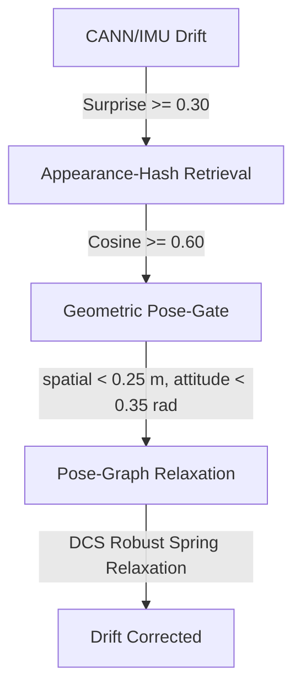

# neuro-symbolic-slam: Split-Brain Neuro-Symbolic Spiking SLAM

**neuro-symbolic-slam** is a JAX-accelerated, biologically plausible **Neuro-Symbolic Spiking SLAM** system for neuromorphic robotics. It unifies high-frequency event-driven visual processing, spiking continuous attractor network dynamics, and Hebbian plasticity to track 3-DOF robot poses, construct topological spatial maps, and close loops with industrial-grade robustness.

Key features include:
* **Split-Brain Vision Frontend:** Combines a fixed convolutional spiking neural network (CSNN) for instant edge-extraction with a plastic, self-organizing STDP frontend that learns custom receptive fields on event time-surfaces.
* **Continuous Attractor Dynamics (CANN):** Implements a 2D grid-cell continuous bump attractor for spatial path-integration and a 1D ring attractor to track body-pitch attitude in continuous time without Euler overshoot (via RK2 midpoint integration).
* **Complementary Filter Gravity Correction:** Integrates an on-board Complementary Filter fusing proper thoracic acceleration (subject to natural flapping vibrations) and the pitch-rate gyro to estimate absolute gravity pitch ($\theta_{\text{accel}} = \mathrm{atan2}(a_x, a_z)$), injecting a Gaussian corrective current into the 1D Ring Attractor to bound pitch-attitude drift.
* **Activity-Dependent Synaptic Scaling:** Leverages a biologically grounded L1 weight scaling rule alongside an Asymmetric Instar update rule (Fast Learn, Slow Forget) to keep synaptic weights completely stable during idle periods and prevent catastrophic forgetting.
* **Appearance-Keyed Loop Closure:** Generates revisit candidates from a pose-independent sparse binary appearance hash (fixed random projection + k-WTA, 32-of-256; FlyHash motif, Dasgupta et al. 2017 -- NOT hyperdimensional/VSA: no binding, bundling, or permutation) (cosine similarity $\ge 0.60$), admits them through a geometric pose-consistency gate (spatial $< 0.25$ m, attitude $< 0.35$ rad), and corrects the trajectory by pose-graph relaxation. **The fired-closure precision (1.000) comes from the geometric gate, not the descriptor.** The place-cell confidence gates (sequence coherence, visual-flow-vs-attractor-velocity, temporal counter) govern *map learning* -- when a place is written to memory -- and do **not** gate closure firing.
* **Robust Graph Relaxation:** Integrates a spring-mass network graph optimizer equipped with **Dynamic Covariance Scaling (DCS)** outlier rejection, allowing the graph to seamlessly ignore false matches while permanently locking valid loops.
* **Pure Functional JAX Architecture:** Designed from the ground up using pure functional programming in JAX, allowing zero-mutation state propagation, high-frequency execution, and compilation to GPU/TPU accelerators.

### 📂 Project Structure

```text
neuro-symbolic-slam/            <-- this subsystem (repo root is one level up)
├── src/                        <-- Core Neural Components
│   ├── snn_slam_system.py      # Split-Brain system orchestrator (Perception/Inference/Odo/Mapping)
│   ├── snn_live_slam.py        # Live SLAM loop coordinator & loop-closure gating pipeline
│   ├── snn_place_cells.py      # Place cell mapping, Hebbian memory bank & surprise computation
│   ├── snn_pose_cann.py        # 2D grid-cell and 1D pitch-attitude ring attractor networks
│   ├── snn_vision_stdp.py      # Unsupervised STDP layer with active-dependent Synaptic Scaling
│   ├── snn_vision_fusion.py    # Spatiotemporal fusion of polarized CSNN and STDP visual channels
│   ├── snn_vision_csnn.py      # Fixed convolutional spiking neural network edge-extractor
│   ├── sparse_forest.py        # Differentiable virtual arena environment & virtual sensor rendering
│   ├── train_vision_online.py  # Online unsupervised STDP vision training script
│   └── frozen_csnn_weights.msgpack  # Pre-trained sensory CSNN weights (essential resource)
├── scripts/                    <-- Diagnostic & Utility Scripts
│   ├── run_slam.py             # Main entrypoint to execute closed-loop SLAM simulation
│   ├── slam_gate_monitor.py    # Live loop-closure gate diagnostics
│   ├── slam_sweep.py           # Hyperparameter sweep runner
│   ├── slam_variance.py        # Variance analysis across runs
│   └── stress_test.py          # System stress-test harness
```

---

## 🚀 Getting Started

### 1. Installation
Clone the repository and install the pinned environment (Python 3.14; see `requirements.txt` at the repository root):

```bash
git clone https://github.com/lhooz/gravity-anchored-slam.git
cd gravity-anchored-slam
pip install -r requirements.txt
cd neuro-symbolic-slam
```

*(Note: Requires `jax`, `jaxlib`, `numpy`, `matplotlib`, and `msgpack`)*

### 2. Running the System
To run the live SLAM system with the full 4-panel real-time visualization:

```bash
python scripts/run_slam.py
```

> **Note.** `run_slam.py` is the interactive real-time demo and uses its own experimental
> front-end heuristics (extra consistency gates). The **paper's quantitative results** and the
> loop-closure gates reported in the paper (appearance-hash cosine $\ge 0.60$, spatial $< 0.25$ m,
> attitude $< 0.35$ rad, DCS pose-graph relaxation) are produced by `scripts/slam_variance.py`.

---

## 🎨 Under the Hood: Neuro-Symbolic Loop Gating

When the robot moves, physical sensors accumulate tracking errors. To resolve this, the system calculates a **Surprise** signal by checking the overlap between the visual reality (sensory input) and the position-based place cell expectation (CANN attractor belief):

$$\text{Surprise} = 1.0 - \text{Raw}_{\text{Match}}$$

This surprise signal controls two critical neuro-symbolic pathways:
* **Loop Closure Activation ($\text{Surprise} \ge 0.30$):** Under moderate sensory mismatch, the loop closure engine is triggered to query past visual barcodes and execute multi-stage defense gates.
* **Autopilot Learning Freeze ($\text{Surprise} \ge 0.60$):** Under extreme visual discrepancy, unsupervised STDP learning is frozen (autopilot off) to protect the pre-existing visual memory from catastrophic forgetting.

When the loop closure engine is activated ($\ge 0.30$), it initiates the following multi-stage verification pipeline to align the graph:


